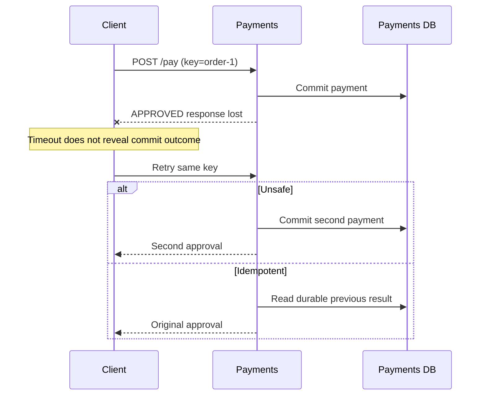

# Commerce failure and resilience lessons

These ten browser and headless scenarios build on the same commerce vocabulary: `order-1`,
a 5000-unit payment, service-owned databases, and explicit network/message
boundaries. Each lesson uses only the topology needed for its teaching point.
They are independent experiments, not successive mutations of one running system.

## Run and inspect

Use Node.js 22.12+ and `npm install`, then:

```sh
npm run lesson -- retry-unsafe
npm run lesson -- retry-idempotent --replay
npm run lesson -- saga-compensated --step
npm run --silent lesson -- outbox-idempotent --json > outbox.json
npm test -w @distlab/catalogs
```

The runner prints a filtered chronological timeline, final state, assertion
results, and an execution digest. `--json` includes the **complete** structured
history, with correlation and fault observations. `--replay` resets the session,
runs again, and verifies identical state, history, results, and digest.
`--step` accepts Enter, `run`, `state`, `reset`, or `quit`; each Enter advances one
scheduler event, not one whole business operation. All times below are virtual
milliseconds. No wall-clock sleeps or real infrastructure are involved.

Run paired names to compare equivalent workloads, fault schedules, and seeds.
A PASS in an unsafe lesson means the **expected failure was observed**, not that
the architecture is safe. Assertion evidence includes the relevant database rows.

In the browser, run `npm run dev`, choose a lesson in **Scenario**, and select
**Load scenario**. Use **Step**, **Run**, and **Reset** as with checkout. The
Architecture tab shows committed service state, client outcomes, KV metrics,
and lesson checks below the graph; selecting a component also shows its facts.
**Recorded history → Story** includes business logs such as compensation and
breaker transitions, as well as network, DB, and fault milestones. Diagram and
Table presentations select the same underlying observations.

**Compare** loads the paired experiment with equivalent inputs and a fresh worker
session (it does not retain a side-by-side result or change rules during a run).
The host accepts only exact packaged documents. Read-only kernel counters replace
the old checkout-only history inference; see [ADR-003](spec/adr/003-boundary-counters.md).

## 1. Timeout, retry, and idempotency

**Pattern:** request idempotency with a durable previous result.

**Problem:** a committed payment and a lost response leave the caller uncertain.
Retrying may repeat the side effect.

**Topology:** Client → Payments → Payments DB. Both calls use `POST /pay` and the
same idempotency key, `order-1`.

**Initial state:** empty payment/result tables; service starts at t=0.

**Injected fault:** Fault Engine drops the first Payments → Client response,
not the request. Network timeout is 20 ms. Exactly one retry follows after 1 ms.



**Expected timeline:** t=1 payment commits; response is dropped; t=20 caller
records ambiguous timeout; t=21 retry begins; t=22 server processes the retry;
t=23 client receives approval. The safe handler logs `payment.previous-result`.
Payment and idempotency result are committed in the same local transaction.

**Expected final state:**

| Run | Payment rows | Returned payment ID |
| --- | ---: | --- |
| `npm run lesson -- retry-unsafe` | 2 | payment-2 |
| `npm run lesson -- retry-idempotent` | 1 | payment-1 |

**Concept:** a timeout does not imply that the remote operation failed. Replaying
the same seed reproduces the ambiguous boundary exactly. This lesson covers a
sequential retry with identical payload; concurrent keys, key expiry, and payload
mismatch rejection are intentionally outside its scope.

## 2. Saga and compensating transactions

**Pattern:** orchestrated, reverse-order business compensation.

**Problem:** independently committed operations cannot be undone by rolling back
one database transaction.

**Topology:** Client → Orders; Orders → Inventory, Payments, and external Carrier.
Orders, Inventory, and Payments each own a database.

**Initial state:** no order, reservation, or payment. Services start at t=0.

**Injected fault:** Fault Engine drops the `POST /ship` request before it reaches
Carrier. Inventory reservation and payment approval have already committed.

**Expected timeline:** create order → reserve inventory → approve payment →
shipment request lost → timeout → `NEEDS_COMPENSATION`. At t=30 assertions show
the order incomplete, inventory reserved, and payment approved. The safe variant
waits 10 virtual ms after the timeout to expose that inconsistent state, then
performs refund → release → cancel. Logs distinguish `saga.forward`,
`saga.inconsistent`, and `saga.compensation`; DB commits expose each local change.

**Expected final state at t=60:**

| Run | Order | Inventory reserved | Payment refunded |
| --- | --- | --- | --- |
| `npm run lesson -- saga-uncompensated` | NEEDS_COMPENSATION | true | false |
| `npm run lesson -- saga-compensated` | CANCELLED | false | true |

**Concept:** compensation is another business operation, not a global rollback.
The fixture deliberately has no shipment side effect and reliable compensation
links. In a real ambiguous shipment outcome, cancellation/status reconciliation
and retryable compensation would also be necessary; this is not a general saga
recovery engine.

## 3. Transactional outbox and at-least-once delivery

**Pattern:** atomic local payment/outbox persistence, asynchronous relay, and
transactional consumer inbox.

**Problem:** a service can crash after its DB commit but before publication;
publishing later can also produce duplicate consumer effects.

**Topology:** Client → Payments → Payments DB (payment + outbox); Payments relay →
MessageBus `PaymentApproved` → Notifications → Notifications DB (intent + inbox).
A notification row represents a durable notification intent, not a real email.

**Initial state:** all four tables empty; services running at t=0.

**Injected faults:** scheduled Fault Engine crash of Payments at t=5 and duplicate
message delivery with one additional copy spaced 3 ms apart. Both outbox variants
and the unsafe dual-write variant use the same fault inputs (the delivery rule
never fires if no event is published).

**Expected timeline:**

1. t=1: local payment commit. Outbox variants insert the event in that **same**
   transaction; unsafe dual write has no durable event record.
2. t=5: crash during the 10 ms commit-to-publish window. Committed rows survive;
   publication continuation is abandoned. At t=6 no notification exists.
3. t=15/16: restart through STARTING → RUNNING.
4. t=17: a maintenance client requests one relay tick. The service schedules its
   own background handler; t=19 it publishes pending outbox events asynchronously.
   The relay then marks each record sent. It does not share another service's DB.
5. t=20/23: consumer sees the same event twice. Its acknowledgement is held for
   5 ms after commit so the duplicate arrives before the bus settles the delivery.
   Safe processing commits the notification and inbox together, keyed by the
   stable business event ID, and ignores the second copy.

**Expected final state at t=50:**

| Run | Payments | Sent outbox rows | Notification effects |
| --- | ---: | ---: | ---: |
| `npm run lesson -- dual-write` | 1 | 0 | 0 |
| `npm run lesson -- outbox-unsafe-consumer` | 1 | 1 | 2 |
| `npm run lesson -- outbox-idempotent` | 1 | 1 | 1 |

**Concept:** local atomicity solves the lost-event gap, not exactly-once delivery.
A relay crash between publish and marking sent can republish a logical event;
the stable event ID is what makes consumer deduplication meaningful. The lesson
injects duplicates through the bus rather than simulating that second crash.
An additional automated commit-failure test proves payment and outbox roll back
together. The relay is a finite tick so a classroom run terminates; it is not a
production daemon or an automatic startup hook.

## 4. Eventual consistency and CQRS

**Pattern:** asynchronous read-model projection.

**Problem:** a successful write does not guarantee an immediately fresh read from
a different service.

**Topology:** Client → Orders → Orders DB; Orders → MessageBus `OrderUpdated` →
Reporting → Reporting DB. Client can read both services through VirtualNetwork.

**Initial state:** both databases contain `order-1` with status PENDING, version 0.

**Injected fault:** Fault Engine adds 40 ms to the first `OrderUpdated` delivery.

**Expected timeline:** t=1 write model commits PAID/version 1 and publishes;
t=10 assertions show PAID/PENDING; early network reads confirm the mismatch;
t=42 event reaches Reporting and the projection commits PAID/version 1; later
network reads show agreement. Logs: `cqrs.write-read`, `cqrs.projection-read`,
`cqrs.converged`.

**Expected final state:** both models PAID at t=60, with one order each.

```sh
npm run lesson -- cqrs-delayed --step
```

**Concept:** a distributed system can be correct while temporarily exposing stale
state. The consumer has one update to project; arbitrary event reordering and
projection rebuilds are not modeled in this lesson. Convergence, rather than a
synchronous read-after-write guarantee, is the invariant.

## 5. Circuit breaker and cascading failure

**Pattern:** threshold-based breaker with cooldown and one half-open probe.

**Problem:** waiting on a slow dependency consumes upstream in-flight work and
propagates failure/latency through a call chain.

**Topology:** Client → API → Orders → Payments → external Risk Provider. The
breaker belongs to Payments at its dependency boundary; it is not a network flag.

**Initial state:** no in-flight requests, zero metrics, CLOSED breaker. The same
16-request workload includes an initial burst, a larger second burst, simultaneous
recovery requests, and a final healthy request.

**Injected fault:** until t=60, Fault Engine adds 60 ms request latency on the
Payments → Risk link; Payments times out after 20 ms. Outer links have larger
budgets, so failure results propagate back through Orders and API. Late provider
replies do not retroactively make a timed-out request successful.

**Expected timeline:** first requests accumulate; two failures open the breaker;
already admitted work still times out; the second burst fails fast while OPEN;
after 30 ms cooldown the next request enters HALF_OPEN and admits one probe,
rejecting its concurrent peer; success closes the circuit. `breaker.state` logs
show CLOSED → OPEN → HALF_OPEN → CLOSED. `dependency.waiting` and
`dependency.completed` expose active requests, peak concurrency, and virtual wait.

**Expected final state at t=120:**

| Run | Risk calls | Timed-out dependency calls | Fast rejections | Peak Payments waiters |
| --- | ---: | ---: | ---: | ---: |
| `npm run lesson -- cascade-unprotected` | 16 | 13 | 0 | 10 |
| `npm run lesson -- cascade-breaker` | 5 | 3 | 11 | 3 |

All upstream work drains and healthy requests succeed. Tests also compare API,
Orders, and Payments aggregate wait and peak concurrency: both are lower with
protection. Metrics are available at each service's `dependency` key in its
KeyValueStore; atomic updates avoid introducing database contention into this
experiment. Logs provide intermediate states. Aggregate wait is virtual milliseconds summed
across calls, not wall-clock time or a percentile.

**Concept:** fail-fast protection reduces dependency pressure and waiting, but
does not magically turn rejected requests into successful business operations.
The simulation models accumulating in-flight handlers, not CPU/thread-pool
exhaustion. The breaker does not cancel calls already in flight.

## Extension points and boundaries

The implementation uses versioned `ScenarioModel` factories in
`packages/catalogs/src/commerce/`, data-only documents in `commerce/scenarios.ts`,
and the existing `DeterministicScenarioEngine`/`openHarness`. The existing checkout
catalog is unchanged. Models use controlled generator tasks, VirtualClock,
VirtualNetwork, Database, MessageBus, Fault Engine, and `runtime.log`.
KeyValueStore holds atomic circuit metrics; durable payment and consumer
deduplication use local DB transactions.

The headless lessons required no new simulation semantics. Browser integration
adds read-only Simulation counters because the initial host inferred counts from
checkout history; scheduling and golden digests remain unchanged. The
existing service clock schedules relay background work; a finite maintenance
request bootstraps it after restart. No simulation state depends on host timers,
randomness, fetch, or external infrastructure.

All documents carry explicit state/count or metric assertions. Tests validate each document,
exercise the behavioral invariants, and compare complete fresh, reset, and stepped
exports. Scenario pairs share their seed, workload, and faults; only the relevant
policy configuration and expected results differ.
